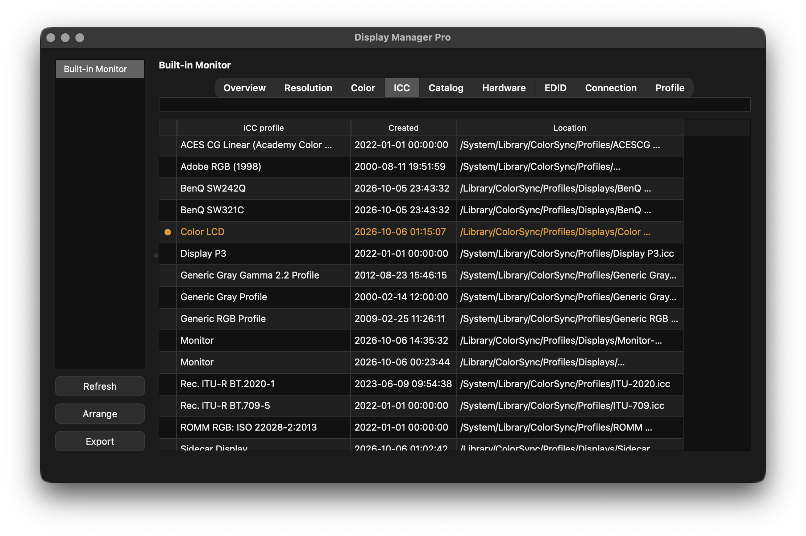
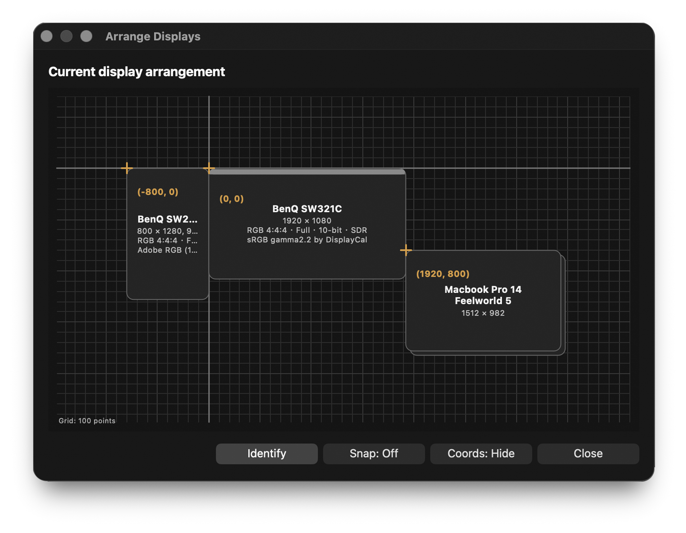

# Display Manager Pro

A macOS utility for inspecting, arranging, and configuring connected displays.

Display Manager Pro brings display information and everyday layout controls together in one place. It reads the modes and connection details reported by macOS and the display driver, and provides tools for arranging displays, identifying screens, and projecting mapping grids.

---

## Features

- Inspect display roles, desktop and framebuffer resolutions, refresh rates, color output, ICC profiles, hardware details, EDID, and connection information.
- Browse the display modes reported by macOS and the display driver, with current settings clearly marked.
- Change supported resolutions and refresh rates, and apply available color modes, ICC profiles, and orientations.
- Arrange displays by dragging them, set the main display, and work with mirrored display groups.
- Identify displays with on-screen labels, or show configurable mapping grids on one or all displays.
- Export a local diagnostic report for troubleshooting and record keeping.
- Choose Dark, Light, or System appearance and use keyboard shortcuts for common actions.

## Download

[Download Display Manager Pro v1.2.1 for macOS (.dmg)](https://github.com/yuchungchen1214/display-manager-pro/releases/download/v1.2.1/DisplayManagerPro-v1.2.1-macOS.dmg)

See the [v1.2.1 release notes](https://github.com/yuchungchen1214/display-manager-pro/releases/tag/v1.2.1).

## Important notes

- This is a macOS-only application. It reads information exposed by macOS and connected display drivers; reported modes and connection details can vary by hardware, adapters, drivers, and macOS version.
- Exported diagnostic reports can contain display names, identifiers, EDID and registry information, ICC profile metadata, and other device details. Review a report before sharing it publicly.
- Available display information and settings can vary by Mac, display, connection, and driver.

## Build from source

The app is built for macOS and uses Python, PySide6, PyInstaller, and small native helpers compiled with Apple's Command Line Tools. The current packaging scripts reflect the maintainer's development environment and are not yet a portable contributor setup. Build instructions and dependency versions will be documented before source builds are advertised as supported.

## Documentation

- [Release notes for v1.1.0](docs/RELEASE-NOTES-v1.1.0.md)
- [Connection probe and known data limits](docs/CONNECTION-PROBE.md)
- [Extended diagnostics](docs/EXTENDED-DIAGNOSTICS.md)
- [Display route evidence](docs/HUB-ROUTES.md)
- [Changelog](CHANGELOG.md)

## License

Display Manager Pro's original code is licensed under the GNU Affero General Public License v3.0 or any later version (AGPL-3.0-or-later). See [LICENSE](LICENSE) for the license identifier and the link to the complete terms.

The bundled application also contains separately licensed third-party components. Their versions, license routes, and notices are listed in [THIRD_PARTY_NOTICES.md](THIRD_PARTY_NOTICES.md); those component licenses do not replace or change the license for Display Manager Pro's original code.
